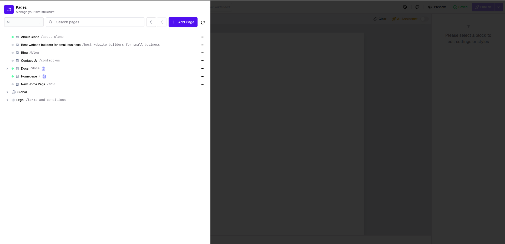
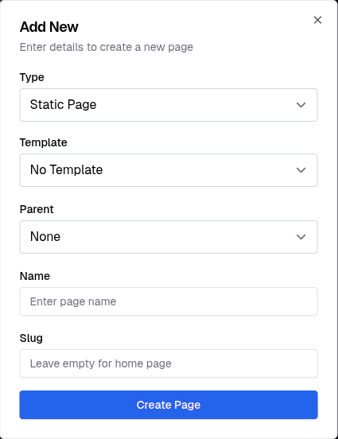

Creating a new page in your ChaiBuilder instance is simple and fast. Follow the steps below to get started.

---

## 1. Login to Chai Builder Instance

Open the URL for your builder instance and log in with your credentials.

---

## 2. Click **Add Page** at the Top of the Left Panel

Once logged in, navigate to your site’s dashboard. On the left sidebar, click **Add Page** to create a new page.

---

## 3. Enter Page Details

A popup form will appear asking for the following details:

- **Page Type** – Select the type of page (e.g., Static, Dynamic, Blog).
- **Template** – (Optional) Choose a template to start with
- **Slug** – Provide a unique URL slug for the new page.
- **Parent** – (Optional) Choose a parent page if this is a subpage.

---

## 4. Create the Page

Click on **Create Page** to save and add the new page to your site.

Your new page will now be available in the builder and ready for editing!
